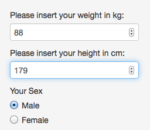
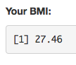
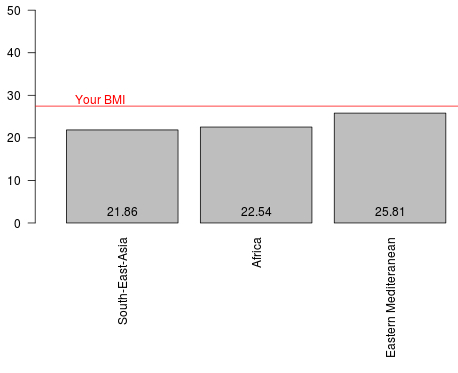

## Body Mass Index
The Body Mass Index (BMI) is a measure of relative weight
based on an individual's mass and height. (Source: http://en.wikipedia.org/wiki/Body_mass_index)
<br><br><br>
</img>
It is calculated as:  $$BMI = \frac{mass(kg)}{height(m)^2}$$
<br>
Example in r (weight = 88kg, height = 1.79m):

```r
weight <- 88
height <- 1.79
round(weight/(height)^2, 2)
```

```
## [1] 27.46
```


--- .class #id 

## Use of the BMI
The BMI is used to assess individual health risks but also to compare averages and show trends.
<br><br><br>
The Global Health Observatory Data Repository of the World Health Organization collected worldwide BMI data, showing the differences in the averages of BMI for different regions of the world.
<br><br><br>
See: <a href="http://apps.who.int/gho/data/node.main.A904">http://apps.who.int/gho/data/node.main.A904</a>

--- .class #id

## Coursera Project: BMI Calculator
The BMI calculator - which was developed as Coursera project - calculates you individual BMI and lets you compare it to the averages of different regions of the world according to your sex.
<br><br>
</img>

--- .class #id

## Coursera Project: BMI Calculator
Insert your weight and your height, choose your sex ...<br>
</img><br>
...and your BMI is calculated...<br>
</img><br>
...and a red line in the barplot will show you, how your BMI compares to the averages of the world regions.<br>
</img><br>
Have fun: <a href="https://teibl.shinyapps.io/Shiny/">https://teibl.shinyapps.io/Shiny/</a>
